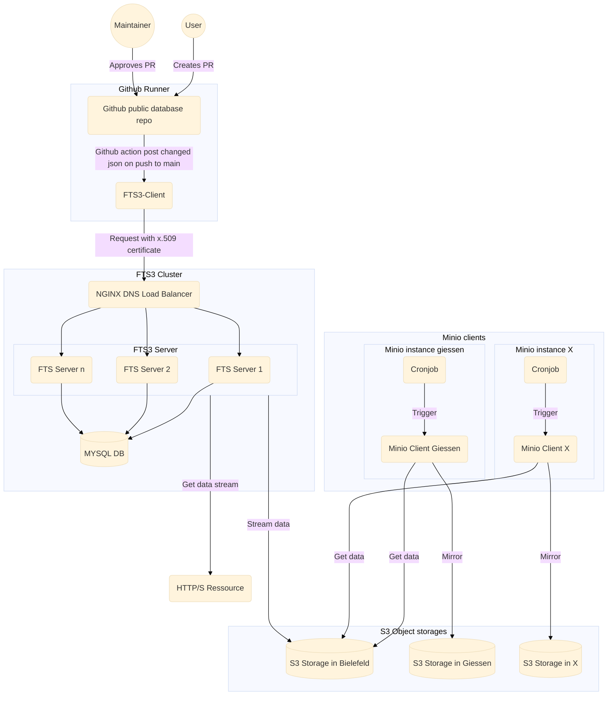

```mermaid
%%{init: {'theme': 'base'}}%%
flowchart TD

    http_ressource(HTTP/S Ressource)

    subgraph runner [Github Runner]
        repo(Github public database repo)
        fts3_client(FTS3-Client)
        repo-->|Github action post changed json on push to main|fts3_client
    end

    user((User))
    maintainer((Maintainer))
    user-->|Creates PR|repo
    maintainer-->|Approves PR|repo

    subgraph fts_cluster [FTS3 Cluster]
        nginx(NGINX DNS Load Balancer)
        subgraph worker [FTS3 Server]
            fts1(FTS Server 1)
            fts2(FTS Server 2)
            ftsn(FTS Server n)
        end
        mysql[(MYSQL DB)]
        nginx-->fts1-->mysql
        nginx-->fts2-->mysql
        nginx-->ftsn-->mysql
        fts3_client-->|Request with x.509 certificate|nginx
    end

    subgraph clouds [S3 Object storages]
        bielefeld_s3[(S3 Storage in Bielefeld)]
        giessen_s3[(S3 Storage in Giessen)]
        x_s3[(S3 Storage in X)]    
    end

    subgraph minio_clients [Minio clients]
        subgraph migi [Minio instance giessen]
            crongi(Cronjob)
            mcgi(Minio Client Giessen) 
            crongi-->|Trigger|mcgi       
        end
        subgraph mix [Minio instance X]
            cronx(Cronjob)
            mcx(Minio Client X)
            cronx-->|Trigger|mcx       
        end
    end

    worker---->|Get data stream|http_ressource
    worker----->|Stream data|bielefeld_s3
    mcgi---->|Get data|bielefeld_s3
    mcgi---->|Mirror|giessen_s3
    mcx--->|Mirror|x_s3
    mcx--->|Get data|bielefeld_s3
    
```